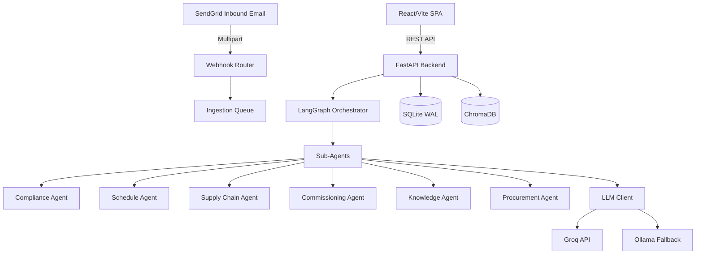

# DataForge AI — Data Centre Project Intelligence API
## Definitive Technical Reference

### 1. Executive Summary
This repository implements a modular "Agentic" architecture for Tier IV data centre EPC (Engineering, Procurement, and Construction) project management. It features a FastAPI backend orchestrating multiple domain-specific AI agents via LangGraph, and a React/Vite Single Page Application frontend. The system focuses on automated compliance checking, schedule risk analysis, RFI management, and procurement optimization using LLMs (Groq primary, Ollama fallback) and RAG (ChromaDB).

### 2. System Architecture

### 3. Backend (FastAPI) Configuration
**Entry Point**: `server/main.py`
* **Lifespan Hooks**: Initializes SQLite database and ChromaDB vector store upon startup, creates necessary directories (`uploads`, `chroma_db`), and validates environment variables.
* **Concurrency**: 
  - Standard FastAPI async routers.
  - Background CPU-bound tasks (OCR, PDF Extraction, batch LLM calls) utilize `ThreadPoolExecutor` within the respective service files.
* **Middleware**:
  - `CORSMiddleware`: Permits origins defined in `CORS_ORIGINS`.
  - Custom HTTP Middleware: Injects `X-Process-Time` and `X-Request-ID` into response headers and logs all request details.
* **Exception Handling**: Global catch-all handlers for 404, 405, and 500, responding with structured JSON including a timestamp and URL path.
* **Frontend Serving**: Mounts compiled React SPA from `client/dist` directly if present, routing non-API paths to `index.html`.

### 4. Data Persistence Layer

#### 4.1 Relational Store (SQLite)
* **Configuration**: Implements Write-Ahead Logging (WAL) for concurrent read/write support (`PRAGMA journal_mode=WAL`).
* **Schema Initialization**: Defined in `server/database/schema.py` via automated raw SQL migrations.
* **Key Tables**: `projects`, `spec_clauses`, `equipment_items`, `tenders`, `purchase_orders`, `deviations`, `ncrs`, `schedule_tasks`, `rfis`, `commissioning_records`, `documents`.

#### 4.2 Vector Store (ChromaDB)
* **Location**: `server/services/vector_store.py`
* **Thread Safety**: Uses `threading.RLock` to implement thread-safe singletons for database clients and models.
* **Embedding Model**: `all-MiniLM-L6-v2` via `sentence-transformers` running locally.
* **Collections**:
  * `spec_clauses`: Stores specification requirements.
  * `rfis`: Stores historical and active RFIs.
  * `standards`: Stores industry standards.
  * `document_memory`: Memory context for user interactions.
  * `commissioning_checklists`: Historical commissioning templates.

### 5. Services & Integrations

#### 5.1 LLM Integration (`server/services/llm_client.py`)
* Wraps external LLM calls.
* **Providers**: Groq (Primary), Ollama (Local Fallback).
* **Key Rotation**: Implements round-robin selection over a comma-separated list of `GROQ_API_KEYS`.
* **Resilience**: Uses regex fallback parsing if the LLM output violates pure JSON formatting. Exposes `call_claude_batch` utilizing `ThreadPoolExecutor`.

#### 5.2 Document Extraction (`server/services/pdf_extractor.py`)
* Extracts text from PDFs using `PyMuPDF`.
* Fallback to Tesseract OCR if text extraction yields minimal content.
* Thread-safe execution using `ThreadPoolExecutor`.

#### 5.3 External Webhooks (`server/routers/webhooks.py`)
* **SendGrid Inbound Parse**: Endpoint at `POST /api/webhooks/inbound-email`.
* **Flow**:
  1. Expects `multipart/form-data`.
  2. Extracts `project_id` from the username part of the `to` address (e.g., stripping `<project-123@domain.com>` to `123`).
  3. Iterates over form values; isolates `.pdf` attachments.
  4. Saves attachments as `specification` documents and asynchronously enqueues them for background parsing (`_parse_spec_bg`) using `ingestion_queue`.

### 6. AI Agent Orchestration

**Orchestrator Agent**: Located in `server/agents/orchestrator_agent.py`, it leverages `langgraph.graph.StateGraph` to classify user intents via an LLM system prompt and route the state to appropriate sub-agents (Schedule, Compliance, Commissioning, Knowledge, Procurement).

#### 6.1 Compliance Agent (`server/agents/compliance_agent.py`)
Compares vendor submittals against specification requirements and automatically generates Non-Conformance Reports (NCRs). Batch processes LLM validations.

**Attribute Normalization**:
Maps common terminology to canonical DB forms (e.g., `thd_output` -> `output_thdu_pct`).

**Deviation Mathematical Models**:
1. **MIN Tolerance**: If `sub < req`, `deviation_pct = |req - sub| / req * 100`
2. **MAX Tolerance**: If `sub > req`, `deviation_pct = |sub - req| / req * 100`
3. **EXACT Tolerance (with %)**: Bounds = `req * (1 ± tol/100)`. Deviant if outside bounds. `deviation_pct = |sub - req| / req * 100`
4. **EXACT Tolerance (no %)**: Deviant if `|sub - req| > 0.001`

**Heuristic Severity Scoring**:
If the LLM fails, falls back to static threshold mapping:
* **CRITICAL**: `deviation >= 15%`. `w_conform = min(0.95, 0.75 + (pct - 15) * 0.01)`
* **MAJOR**: `deviation >= 10%`. `w_conform = 0.50 + (pct - 10) * 0.05`
* **MINOR**: `deviation >= 5%`. `w_conform = 0.15 + (pct - 5) * 0.07`
* **OBSERVATION**: `deviation < 5%`. `w_conform = max(0.0, pct * 0.03)`
* **Missing Mandatory Item**: `CRITICAL`, `w_conform = 0.90`
* **Invalid Document**: `CRITICAL`, `w_conform = 1.0`

**Conformance Score Output**:
Final score is the average across all deviations:
`Score = AVG( severity_base_weight * w_conform )`
Where weights are: CRITICAL=0.0, MAJOR=0.3, MINOR=0.6, OBSERVATION=0.9.

#### 6.2 Schedule Agent (`server/agents/schedule_agent.py`)
Evaluates scheduling risk levels.
* Uses `total_float_days` to determine flexibility.
* Considers procurement delay factors to recalculate impact on the critical path.

#### 6.3 Supply Chain Agent (`server/agents/supply_chain_agent.py`)
Computes distance-based delivery risks.
* Employs the **Haversine formula** to calculate great-circle distances between origin and destination coordinates.
* Converts distance to transit delays mathematically.

#### 6.4 Commissioning Agent (`server/agents/commissioning_agent.py`)
Generates equipment-specific commissioning checklists (UPS, PDU, COOLING, GENERATOR).
* Auto-evaluates string pass/fail statuses or numeric threshold criteria (e.g., `> 1` or `< 5`).
* Raises automated NCRs (referencing standard Purchase Orders) if tests fail.

#### 6.5 Knowledge Agent (`server/agents/knowledge_agent.py`)
Provides technical Q&A via RAG.
* Queries ChromaDB across Spec Clauses, RFIs, and manual `document_memory` injections.
* **Precedent Threshold**: Assumes RFIs are precedents only if vector similarity score > `0.82` and `is_resolved == true`.
* Explicit memory injection supports commands starting with `remember:` or `save:`.

#### 6.6 Procurement Agent (`server/agents/procurement_agent.py`)
Analyzes vendor bids based on price, lead time, compliance, and risk.
* **Fallback Heuristic**:
  - `price_score = max(0, 10 - (price / 10000))`
  - `lead_time_score = max(0, 10 - (lead_time / 10))`
  - `overall = (price_score + lead_time_score + compliance_score + risk_score) / 4`
  - Recommends vendor if `overall > 8`.

### 7. Frontend Client
* **Tech Stack**: React.js bundled via Vite (`client/src`).
* **Styling**: Tailwind CSS extended via `client/src/index.css`. Overrides standard utility classes to enforce a unified "emerald and copper" premium dark mode aesthetic (glassmorphism via `backdrop-filter`, `blueprint-grid` backgrounds).
